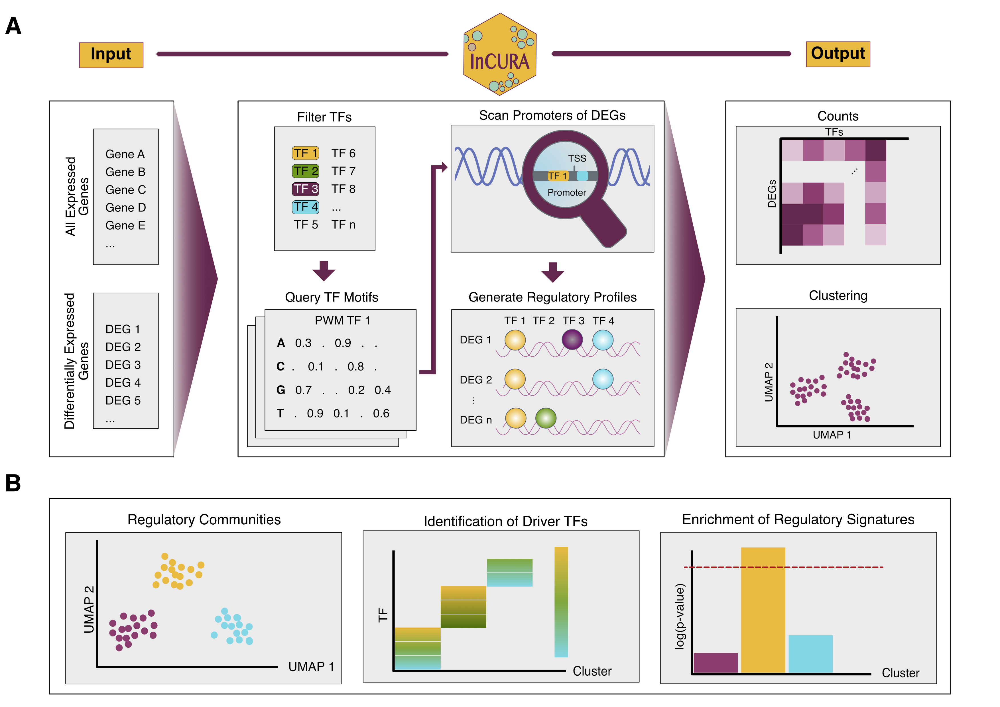

# InCURA 
## Integrative Gene Clustering on Transcription Factor Binding Sites 

### Concept
Biologically meaningful interpretation of transcriptomic datasets remains challenging, particularly when context-specific gene sets are either unavailable or too generic to capture the underlying biology. We present InCURA, an integrative clustering strategy based on transcription factor (TF) motif occurrence patterns in gene promoters. InCURA relies on a user-friendly input of lists of (i) all expressed genes, used to identify dataset-specific TFs, and (ii) differentially expressed genes (DEGs). Promoter sequences of DEGs are scanned for TF binding motifs, and the resulting counts are compiled into a gene-by-TF matrix. InCURA then uses unsupervised clustering to infer gene modules with shared predicted regulatory input. Employing InCURA to diverse biological datasets, we uncovered functionally coherent gene modules revealing upstream regulators and regulatory programs that standard enrichment or co-expression analyses, such as WGCNA, fail to detect. Together, InCURA provides a regulation-centric tool for dissecting transcriptional responses for fundamental biological discovery research, particularly in settings lacking context-specific gene sets.



### Usage
A basic version of InCURA is implemented as a user friendly web application: **LINK**

**Note:** 
This version allows analysis of two different promoter lengths. I) A long promoter region: -2000, 500 bp around TSS and II) a shorter promoter region: -1000, 200 bp around TSS. Further it uses a fixed background model for motif scanning derived from the promoter regions of all coding genes. 

If you would like to manipulate other parameters in the InCURA workflow please clone the GitHub repository. Please note that incura needs apptainer (formerly singularity) to run, to reproduce the environment. For installation please check the [documentation](https://apptainer.org/documentation/).

### Installation
Clone repo:
```
git clone git@github.com:saezlab/incura.git
cd incura
```

Then create a new enviroment specific for `Snakemake`:
```
mamba create -c conda-forge -c bioconda -n snakemake snakemake
mamba activate snakemake
```

### Configuration
Make sure to change the organism in the config file according to your needs. And if not mouse or human, add a valid download link for a reference genome. 

Add your DEGs_myDataset.txt and all_genes.txt to the data directory and modify the Snakefile according to your dataset: 

```
rule all:
    input: 
        'data/fimo_myDataset/fimo.tsv'
```

### Run 
Run the workflow with snakemake. Change the cores according to your computational resources: 

```
snakemake -s workflow/Snakefile --cores 8 --use-singularity
```


### Citation

[](https://doi.org/10.5281/zenodo.15753472)


